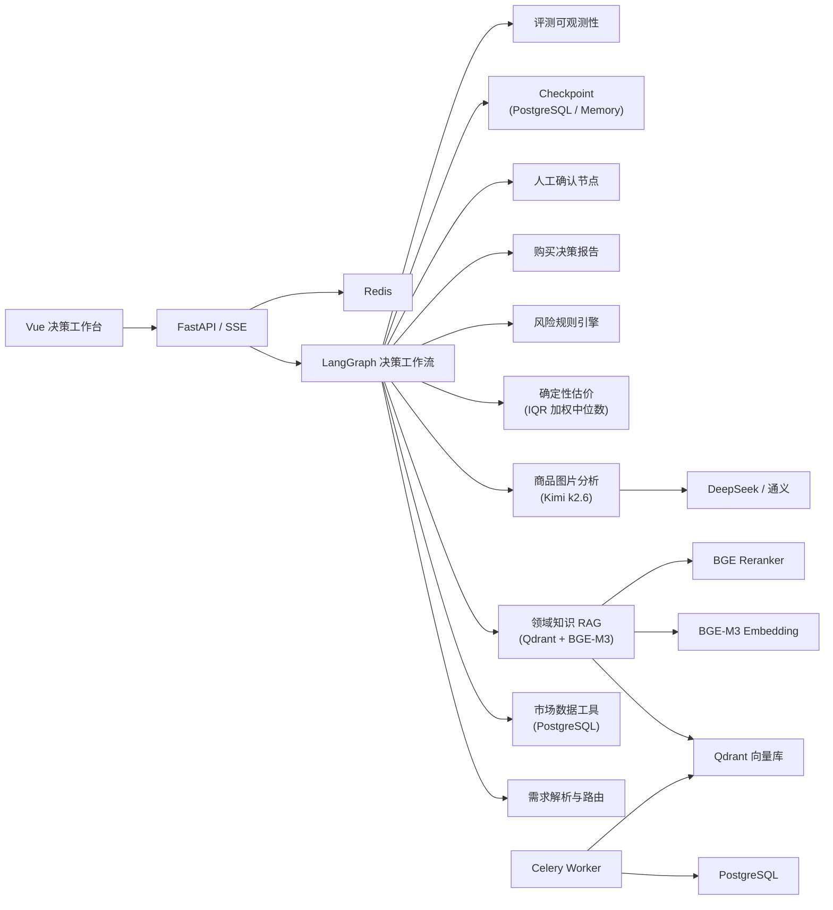

# 估二手 — AI 二手数码选购与估价 Agent

> 输入预算、用途、型号或图片 → 系统自动检索市场数据与领域知识 → 输出带证据来源的购买决策报告

[](https://github.com/Kuang-xianxin/Second-hand-Estimate/actions/workflows/ci.yml)


---

## 架构



## 技术栈

| 层级 | 选型 | 职责 |
|------|------|------|
| 前端 | Vue 3 + TypeScript + Vite | 决策工作台、执行时间线、证据展示 |
| API | FastAPI + Pydantic v2 + SSE | 异步接口、流式进度 |
| Agent | LangGraph | 状态机、条件分支、暂停/恢复 |
| AI 适配 | LangChain | 模型适配、结构化输出 |
| 推理模型 | DeepSeek / 通义千问 | 意图理解、推理、报告 |
| Embedding | BGE-M3 | 中文 Dense/Sparse 表示 |
| Reranker | BGE-reranker-v2-m3 | Cross-Encoder 精排 |
| 向量库 | Qdrant | 混合检索、Payload Filter |
| 业务库 | PostgreSQL / SQLite | 商品、价格、用户、运行记录 |
| Agent 状态 | MemorySaver / AsyncPostgresSaver | Checkpoint 与故障恢复 |
| 缓存/队列 | Redis + Celery | 缓存、异步抓取、批量向量化 |
| 迁移 | Alembic | Schema 版本管理 |
| 部署 | Docker Compose + Nginx | 一键启动 |
| CI | GitHub Actions | 测试、类型检查、构建 |

## 快速开始

```bash
# 1. 安装依赖
cd backend
pip install -r requirements.txt

# 2. 配置环境变量
cp .env.example .env
# 编辑 .env 填入 API Key

# 3. 初始化数据库
python -m alembic upgrade head

# 4. 启动
uvicorn main:app --reload

# 5. 导入 CCD 知识库（可选，需要 Qdrant）
python -c "
from app.rag.ingestion import ingest_documents
from app.rag.seed_data import get_all_seed_documents
from qdrant_client import QdrantClient
import asyncio
c = QdrantClient(path='/tmp/guessr_qdrant')
asyncio.run(ingest_documents(c, get_all_seed_documents()))
"
```

### Docker Compose 一键启动

```bash
docker compose up -d
# 启动: Qdrant + Redis + PostgreSQL + Celery + Backend (port 8000)
```

## API

| 方法 | 路径 | 说明 |
|------|------|------|
| `POST` | `/api/advisor/runs` | 启动估价决策 |
| `GET` | `/api/advisor/runs/{id}/stream` | SSE 流式节点事件 |
| `GET` | `/api/advisor/runs/{id}` | 查询运行状态 |
| `POST` | `/api/advisor/runs/{id}/decisions` | 人工审批 |
| `POST` | `/api/advisor/runs/{id}/feedback` | 用户反馈 |
| `POST` | `/api/valuate` | 快速估价（非 Agent） |
| `GET` | `/api/cache/status` | 缓存状态 |
| `GET` | `/api/stats/overview` | 系统统计 |
| `GET` | `/health` | 健康检查 |

## 项目结构

```
backend/
├── app/
│   ├── agents/           # LangGraph 决策工作流
│   │   ├── state.py      # AdvisorState (共享状态)
│   │   ├── nodes/        # 14 个工作流节点
│   │   ├── routing.py    # 条件边路由逻辑
│   │   ├── advisor_graph.py  # 图编译 + run/stream/resume
│   │   └── tracing.py    # 成本/延迟追踪
│   ├── ai/               # 模型网关 (llm.py)
│   ├── rag/              # RAG 检索
│   │   ├── chunking.py   # 文档切分
│   │   ├── embeddings.py # BGE-M3 / SimpleHash
│   │   ├── retriever.py  # Dense + Sparse + RRF
│   │   ├── reranker.py   # Cross-Encoder 精排
│   │   ├── ingestion.py  # 文档摄取管道
│   │   ├── citations.py  # 证据引用系统
│   │   ├── evaluation.py # 检索评测指标
│   │   └── seed_data.py  # CCD 领域知识 (18 篇)
│   ├── evaluation/       # 评测体系
│   │   ├── gold_dataset.py  # 120 条黄金评测用例
│   │   └── runner.py     # 评测运行器
│   ├── tasks/            # Celery 异步任务
│   ├── api/              # FastAPI 路由
│   ├── models/           # SQLAlchemy 模型 (24 表)
│   ├── services/         # 业务逻辑
│   └── crawler/          # 闲鱼爬虫
├── migrations/           # Alembic 迁移
├── tests/                # 91 tests
└── Dockerfile
```

## LangGraph 工作流

```
输入 → 需求解析 → 型号归一化 → 路由
  → 市场检索 || 知识检索 || 图片分析
  → 证据评分
    ├─ 不足 & 重试<3 → 查询改写 → 重新检索
    ├─ 不足 & 重试≥3 → 降级估价
    └─ 充分 → IQR 估价 → 风险评估
  → 生成报告
    ├─ 高风险/低置信度 → 人工确认
    │   ├─ 批准 → 校验 → 持久化
    │   └─ 拒绝 → END
    └─ → 引用校验 → 持久化 → END
```

## RAG 检索管道

```
查询结构化 → Metadata Filter (品牌/型号)
  → Dense 召回 Top 40
  → Sparse 召回 Top 40
  → RRF 融合 Top 30
  → BGE Reranker 精排
  → 去重 + 阈值过滤
  → Top 5-8 进入 LLM 上下文
```

## 评测

- **黄金数据集**: 120 条人工标注用例（6 个类别）
- **检索指标**: Recall@K, Precision@K, MRR, nDCG, 型号精确匹配率
- **Agent 指标**: 结构化输出通过率, 引用正确率, 证据忠实度, 人工采纳率
- **四套对照**: 关键词 / Dense / Hybrid RRF / Hybrid + Reranker

## 安全

- 闲鱼登录态不进入 Git（.gitignore）
- Secret 仅通过环境变量注入
- Tool Allowlist 限制模型能力
- 检索文档按不可信输入处理（防 Prompt Injection）
- 限流中间件（60 req/min per IP）
- 不执行外部购买动作（仅分析建议）

## License

MIT
