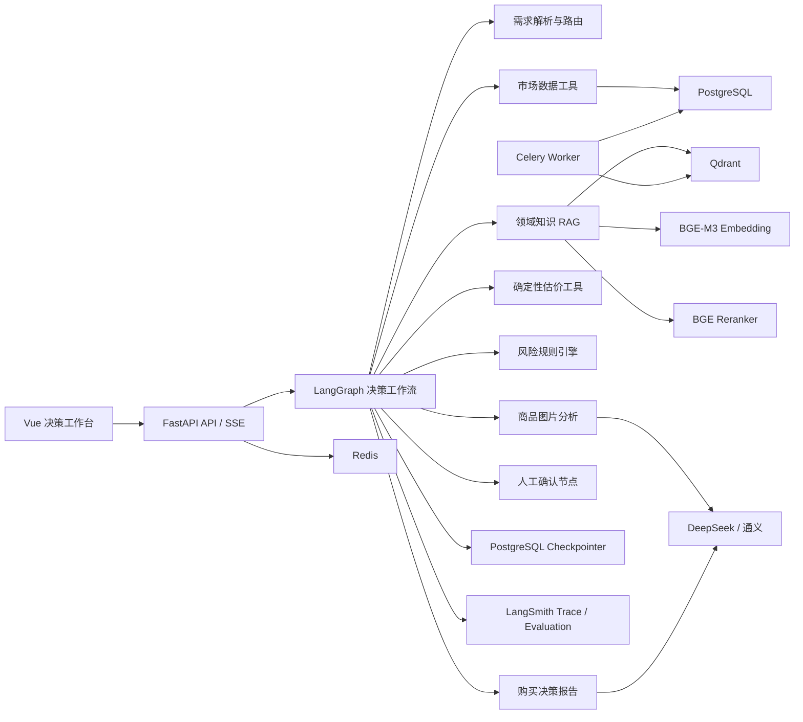

# 估二手：AI 应用工程师作品集完整改造方案

> 文档状态：设计基线（待实施）
> 设计与验收负责人：Codex
> 实施负责人：Hermes
> 创建日期：2026-07-10
> 目标周期：6～8 周

## 1. 项目定位

将现有“二手商品估价工具”升级为：

> **AI 二手数码选购与估价 Agent**：用户输入预算、用途、目标型号、商品链接或图片，系统自动检索实时市场数据与领域知识，分析价格、成色、配件、存储卡和交易风险，最终输出带证据来源的购买决策报告。

本项目用于展示完整的 AI 应用工程能力，而不是简单增加聊天框。核心能力包括：

- LangChain 模型、工具、Retriever 和结构化输出。
- LangGraph 有状态工作流、条件分支、失败恢复和人工确认。
- Qdrant 混合检索、BGE-M3 Embedding 和 BGE Reranker。
- PostgreSQL 结构化市场数据、LangGraph Checkpoint 和历史记录。
- RAG 离线评测、Agent 路径评测和线上可观测性。
- FastAPI、Vue 3、Redis、Celery、Docker Compose 和 CI/CD。

## 2. 当前项目基础

现有项目已经具备以下可复用能力：

- Vue 3、TypeScript、Vite 前端。
- FastAPI、SQLAlchemy Async 后端。
- SSE 流式估价进度。
- DeepSeek、通义、豆包等模型的并发调用。
- 闲鱼样本采集、清洗、统计估价和捡漏识别。
- 商品图片、成色和 xD 卡识别。
- 估价历史、样本快照和价格缓存。
- IQR 去极值、加权中位数及业务规则过滤。

需要优先修复的工程问题：

1. 当前分支引用多个不存在的源码模块，例如 `app.api.auth`、`app.models.redis_client`、`app.services.keyword_tier`。
2. 测试收集因缺失模块失败，当前不能作为稳定开发基线。
3. Git 正在跟踪 `xianyu_storage_state.json`，存在登录会话泄露风险。
4. 仓库包含较多历史调试产物，后续清理前必须先列出范围并取得用户批准。
5. README 中的能力描述与当前可运行状态需要重新核对。

结论：**先恢复工程可信度，再建设 AI 能力。**

## 3. 总体架构



## 4. 技术栈与职责

| 层级 | 选型 | 主要职责 |
|---|---|---|
| 前端 | Vue 3、TypeScript、Vite | 决策工作台、执行时间线、证据展示 |
| API | FastAPI、Pydantic v2、SSE | 异步接口、结构化协议、流式进度 |
| Agent | LangGraph | 状态、分支、循环、暂停、恢复、回放 |
| AI 适配 | LangChain | 模型适配、Tools、Retriever、结构化输出 |
| 推理模型 | DeepSeek、通义千问 | 意图理解、推理、报告、多模态分析 |
| Embedding | BGE-M3 | 中文 Dense/Sparse 表示 |
| Reranker | BGE-reranker-v2-m3 | Cross-Encoder 精排 |
| 向量数据库 | Qdrant | 混合检索、Payload Filter、向量版本管理 |
| 业务数据库 | PostgreSQL | 商品、价格、用户、运行记录、反馈 |
| Agent 状态 | AsyncPostgresSaver | LangGraph Checkpoint 与故障恢复 |
| 缓存与队列 | Redis、Celery | 缓存、异步抓取、批量向量化 |
| AI 可观测性 | LangSmith | Trace、Prompt 版本、数据集与评测 |
| 系统监控 | Prometheus、Grafana | API、数据库、队列和资源指标 |
| 数据迁移 | Alembic | PostgreSQL Schema 版本管理 |
| 部署 | Docker Compose、Nginx | 本地及云端一致部署 |
| CI | GitHub Actions | 测试、类型检查、构建和安全扫描 |

### 4.1 明确不做的事情

- 不为了展示技术而把所有节点拆成多个 Agent。
- 不把实时价格、中位数、库存等数字事实塞进向量库。
- 不让 LLM 代替已有的确定性估价和规则过滤。
- 不切换 React；继续复用 Vue 3，把精力放在 AI 链路。
- 不在没有评测基线前直接微调模型。
- 不在首版引入 Kubernetes、Kafka 等当前规模不需要的设施。

## 5. LangGraph 设计

### 5.1 Agent 状态

```python
class AdvisorState(TypedDict):
    thread_id: str
    user_query: str
    requirement: PurchaseRequirement
    target_models: list[str]
    market_evidence: list[MarketEvidence]
    knowledge_evidence: list[KnowledgeEvidence]
    image_findings: list[ImageFinding]
    valuation: ValuationResult | None
    risks: list[RiskItem]
    report: DecisionReport | None
    confidence: float
    retrieval_attempts: int
    pending_approval: bool
    errors: list[str]
```

状态中只保存可序列化的数据和资源 ID，不保存数据库连接、HTTP Client 或大型模型实例。

### 5.2 节点

1. `parse_requirement`
   - 将自然语言转换为 Pydantic 结构。
   - 提取预算、品牌、型号、用途、成色和风险偏好。

2. `normalize_model`
   - 复用现有型号库和品牌约束。
   - 防止 `F30`、`T2` 等短型号碰撞。

3. `route_request`
   - 路由到单商品估价、机型咨询、横向比较或预算推荐。

4. `retrieve_market_data`
   - 查询 PostgreSQL 中近期有效商品和价格历史。
   - 返回结构化统计结果，而不是自然语言 SQL 结果。

5. `retrieve_knowledge`
   - 查询 Qdrant 中的规格、存储卡、故障和风险知识。

6. `inspect_images`
   - 用户提供图片时分析外观、屏幕、镜头和配件。

7. `grade_evidence`
   - 判断市场样本和知识证据是否充分。
   - 不充分时允许改写查询并重新检索，最多两次。

8. `calculate_valuation`
   - 复用 IQR、加权中位数、成色和附件修正规则。
   - LLM 不直接产生最终价格数字。

9. `assess_risk`
   - 识别配件、租赁、维修、诱饵、相邻型号和存储卡风险。

10. `generate_report`
    - 基于结构化结果和检索证据生成购买报告。

11. `verify_report`
    - 校验引用、价格一致性和无证据断言。

12. `human_review`
    - 低置信度、型号冲突或高风险交易时暂停流程。

13. `persist_feedback`
    - 保存用户是否采纳、证据是否有误及最终反馈。

### 5.3 工作流分支

```text
输入
→ 需求解析
→ 型号归一化
→ 市场检索 || 知识检索 || 图片分析
→ 证据评分
   ├─ 证据不足且未达到重试上限 → 查询改写 → 重新检索
   ├─ 型号不确定或风险过高 → 人工确认
   └─ 证据充分 → 确定性估价 → 风险分析
→ 生成报告
→ 引用与一致性校验
   ├─ 校验失败 → 修正一次
   └─ 校验通过 → 持久化与反馈
```

## 6. RAG 设计

### 6.1 进入 Qdrant 的数据

- CCD 相机规格、系列和型号说明。
- xD、SD、MASD-1 等存储卡知识。
- 常见故障、维修风险和验机步骤。
- 经过脱敏的商品标题与描述。
- 业务过滤规则的自然语言解释。
- 已验证的 FAQ、项目文档和人工结论。

### 6.2 不进入 Qdrant 的数据

- 实时价格、库存、是否已售。
- 中位数、IQR、利润、样本数。
- 用户权限、Agent 任务状态。

这些字段保存在 PostgreSQL，通过只读、参数化的领域工具查询。

### 6.3 文档切分

- 型号规格：一个型号一个文档。
- 故障知识：一个故障点一个 Chunk。
- 商品记录：标题、描述和结构化元数据组成一个文档。
- 长文章：按标题层级切分，同时保存父文档 ID。
- 规则说明：一条业务规则一个文档。

### 6.4 向量 Payload

```json
{
  "document_id": "camera_fuji_f30_storage",
  "document_type": "camera_knowledge",
  "brand": "fujifilm",
  "model": "f30",
  "topic": "storage_card",
  "source": "internal_verified",
  "source_url": null,
  "effective_at": "2026-07-10",
  "content_hash": "sha256:...",
  "embedding_version": "bge-m3-v1"
}
```

### 6.5 检索链路

```text
问题结构化
→ 品牌、型号、数据类型、时间 Metadata Filter
→ Dense 召回 Top 40
→ Sparse 召回 Top 40
→ RRF 融合 Top 30
→ BGE Reranker 精排
→ 同源去重与阈值过滤
→ Top 5～8 进入 LLM 上下文
```

职责区分：

- Dense Embedding：处理语义相似。
- Sparse Retrieval：保护型号、容量等精确关键词。
- Metadata Filter：限制品牌、型号和时间范围。
- RRF：融合多路召回名次。
- Reranker：联合阅读问题和候选文档，提升 Top-K 精度。
- LLM：基于最终证据生成答案。

### 6.6 引用机制

所有事实分成三类：

- `market_fact`：来自 PostgreSQL 市场数据。
- `knowledge_fact`：来自 Qdrant 文档。
- `inference`：模型根据证据推导的结论。

报告示例：

```text
估价区间：¥420～¥560
依据：近 30 天 23 条有效整机样本，中位数 ¥485 [市场证据 M12]

风险：该机型依赖 xD 卡，购买前应确认是否附带存储卡
依据：富士 F30 存储介质说明 [知识证据 K03]
```

证据不足时必须返回“不足以形成可靠结论”，不能补写未经支持的事实。

## 7. 数据库设计

### 7.1 PostgreSQL 主要表

- `products`：标准品牌、型号和别名。
- `market_items`：商品快照。
- `price_observations`：按时间记录价格。
- `valuation_runs`：确定性估价结果。
- `advisor_threads`：用户会话。
- `advisor_runs`：一次 LangGraph 执行。
- `advisor_feedback`：用户反馈。
- `knowledge_documents`：文档版本、Hash 和索引状态。
- `prompt_versions`：Prompt 版本。
- `evaluation_cases`：黄金评测样本。
- `evaluation_runs`：评测结果。

### 7.2 一致性原则

- PostgreSQL 是结构化事实的唯一真相来源。
- Qdrant 保存可重建的向量索引，不作为原始文档唯一存储。
- 向量点通过 `document_id + content_hash + embedding_version` 追踪版本。
- 文档更新后异步重建向量，成功后再切换活动版本。

## 8. API 与前端

### 8.1 API

```text
POST /api/advisor/runs
GET  /api/advisor/runs/{run_id}/stream
GET  /api/advisor/runs/{run_id}
POST /api/advisor/runs/{run_id}/decisions
POST /api/advisor/runs/{run_id}/feedback
POST /api/knowledge/documents
POST /api/knowledge/reindex
GET  /api/evaluation/summary
```

### 8.2 Vue 决策工作台

- 输入预算、用途、型号、链接和图片。
- 展示 LangGraph 节点执行时间线。
- 分栏展示市场证据和知识证据。
- 展示估价区间、购买建议、置信度和风险清单。
- 支持两个或三个型号横向比较。
- 支持低置信度人工确认。
- 支持证据错误和建议质量反馈。
- 历史页展示完整执行轨迹，而不只是最终答案。

## 9. 评测体系

### 9.1 黄金数据集

首版准备 100～150 条人工标注样本：

- 30 条型号与规格查询。
- 25 条价格与趋势查询。
- 20 条相邻型号辨别。
- 20 条配件、租赁、维修和诱饵识别。
- 15 条多条件选购问题。
- 10 条信息不足或冲突问题。
- 10 条 Prompt Injection 和恶意文档测试。

### 9.2 检索指标

- Recall@20。
- Precision@5。
- MRR@10。
- nDCG@10。
- 型号精确匹配率。
- Reranker 前后排序变化。

### 9.3 生成与 Agent 指标

- 引用正确率。
- 证据忠实度。
- 价格一致性。
- 结构化输出通过率。
- 正确工具选择率。
- Agent 路径正确率。
- 无证据断言比例。
- 人工采纳率。

### 9.4 工程目标

以下均为验收目标，实施前不能作为简历成绩：

- 结构化输出成功率不低于 99%。
- 引用正确率不低于 95%。
- Recall@20 不低于 90%。
- 加入 Reranker 后 nDCG@10 相比纯向量基线提升至少 10%。
- 非爬取请求 1 秒内返回首个 SSE 事件。
- 普通决策请求端到端 p95 不高于 15 秒。
- 任一外部模型失败时返回明确的降级结果。

### 9.5 对照实验

必须保存以下四套结果：

1. 纯关键词检索。
2. 纯 Dense 向量检索。
3. Dense + Sparse + RRF。
4. 混合检索 + Reranker + 业务规则。

## 10. 可观测性与安全

### 10.1 LangSmith

记录：

- 模型请求、Token 和费用。
- Prompt 版本。
- LangGraph 节点耗时。
- 工具调用参数和结果摘要。
- 检索候选、分数和 Reranker 顺序。
- 失败节点、重试和降级。
- 用户反馈与评测回放。

### 10.2 Prometheus 与 Grafana

监控：

- API p50、p95、p99 延迟。
- LLM 成功率、超时率和费用。
- Qdrant 检索及重排耗时。
- Celery 队列长度与失败任务。
- PostgreSQL 连接池。
- 爬虫成功率和风控状态。

### 10.3 安全

- 立即使已提交的闲鱼登录态失效。
- Secret 只通过环境变量或部署平台注入。
- 清理 Git 历史前必须单独确认操作范围和风险。
- Tool 使用 Allowlist，禁止模型执行任意 SQL 或系统命令。
- 检索文档按不可信输入处理，防止 Prompt Injection。
- 对商品描述、图片和日志做敏感信息脱敏。
- 管理接口增加 RBAC、限流和审计日志。
- 高风险交易只提供分析，不执行外部购买动作。

## 11. 建议目录

```text
backend/
├─ app/
│  ├─ agents/
│  │  ├─ advisor_graph.py
│  │  ├─ state.py
│  │  ├─ routing.py
│  │  └─ nodes/
│  ├─ ai/
│  │  ├─ model_gateway.py
│  │  ├─ schemas.py
│  │  ├─ safety.py
│  │  └─ prompts/
│  ├─ rag/
│  │  ├─ ingestion.py
│  │  ├─ chunking.py
│  │  ├─ embeddings.py
│  │  ├─ retriever.py
│  │  ├─ reranker.py
│  │  └─ citations.py
│  ├─ tools/
│  │  ├─ market_tool.py
│  │  ├─ valuation_tool.py
│  │  ├─ risk_tool.py
│  │  └─ vision_tool.py
│  ├─ evaluation/
│  │  ├─ datasets/
│  │  ├─ retrieval_eval.py
│  │  └─ generation_eval.py
│  ├─ api/
│  ├─ models/
│  └─ services/
├─ migrations/
└─ tests/
   ├─ unit/
   ├─ integration/
   ├─ e2e/
   └─ evaluation/
```

## 12. 分阶段实施计划

### 阶段 0：恢复工程基线，2～4 天

Hermes 任务：

- 核对缺失模块最后存在的提交，恢复必要源码或删除已经废弃的引用。
- 修复后端 Import 和 Pytest 收集。
- 使泄露的登录会话失效，并停止跟踪本地登录态文件。
- 锁定 Python 和 Node 依赖版本。
- 补充 `.env.example` 和最小启动文档。
- 建立后端测试、前端类型检查和构建 CI。

验收：

```powershell
C:\Python314\python.exe -m pytest -q
C:\Python314\python.exe -m compileall backend
npm --prefix frontend run type-check
npm --prefix frontend run build
git diff --check
```

### 阶段 1：数据底座，5～7 天

Hermes 任务：

- SQLite 迁移 PostgreSQL。
- 引入 Alembic 并提供升级、降级脚本。
- 重构商品、价格、知识文档和 Agent Run 数据模型。
- 引入 Redis + Celery 处理抓取和批量向量化。
- 建立幂等数据清洗任务和数据质量报告。

验收：迁移可重复、任务可重试、重复执行不产生重复数据。

### 阶段 2：RAG，7～10 天

Hermes 任务：

- Docker Compose 增加 Qdrant。
- 接入 BGE-M3 Embedding。
- 实现文档切分、Hash 去重、增量索引和版本切换。
- 实现 Dense + Sparse + RRF。
- 接入 BGE Reranker。
- 建立第一版检索黄金集和基线报告。

验收：输出 Top-K 证据及完整来源，并生成四套检索对照结果。

### 阶段 3：LangGraph Agent，7～10 天

Hermes 任务：

- 实现 State、节点和条件边。
- 将估价、市场查询、风险规则和视觉分析封装为 Tools。
- 增加证据评分、查询改写、重试和降级。
- 使用 AsyncPostgresSaver 保存 Checkpoint。
- 实现人工确认和恢复执行。
- SSE 输出节点级事件。

验收：任务可以暂停、恢复、失败重试并生成带引用的结构化报告。

### 阶段 4：评测与可观测性，5～7 天

Hermes 任务：

- 建立 100～150 条黄金数据集。
- 接入 LangSmith Trace。
- 实现检索、生成和 Agent 路径评测。
- 建立 Prompt 版本对比。
- 增加费用、延迟和失败监控。

验收：每次关键改动可以生成可比较的评测报告。

### 阶段 5：前端、部署与安全，5～7 天

Hermes 任务：

- 完成决策工作台、执行时间线和证据面板。
- 完成人工确认与用户反馈交互。
- 完善 Docker Compose、Nginx、健康检查和备份。
- 增加限流、RBAC、审计和 Secret 管理。
- 更新 README、架构图、演示视频和 API 文档。

验收：新环境可复现部署，面试官可在 5 分钟内理解并体验核心链路。

### 阶段 6：高级加分项，按评测结果决定

- 使用历史正负样本微调 Reranker。
- 使用 MLflow 记录微调实验。
- 增加商品图片的多模态检索。
- 增加多型号并行比较子图。
- 增加 Agent 离线回放与回归测试。
- 增加模型路由和成本优化。

## 13. Codex → Hermes 交接规范

后续采用以下固定流程：

1. 用户提出目标或问题。
2. Codex 检查当前仓库、测试和相关生产状态。
3. Codex 输出具体设计任务包，包括：
   - 目标与非目标。
   - 当前代码路径和改造边界。
   - 数据结构、接口和执行流程。
   - 文件级修改清单。
   - 异常、降级和安全要求。
   - 测试用例与验收命令。
   - 建议提交拆分。
4. 用户将任务包交给 Hermes 实施。
5. Hermes 返回 Commit、Diff、测试结果和未解决问题。
6. Codex 审查实际 Diff 和验证证据，给出通过结论或下一轮修正任务。

每个 Hermes 任务包应该控制在一个可独立审查的目标内。不得使用“把 RAG 做好”“优化 Agent”这种无法验收的描述。

### Hermes 回传模板

```markdown
## 实施结果

- Commit：
- 修改文件：
- 完成内容：
- 未完成内容：

## 验证

- 执行命令：
- 测试结果：
- 指标变化：

## 风险与问题

- 已知风险：
- 需要 Codex 决策的问题：
```

## 14. 作品集交付物

最终仓库至少包含：

- 面向招聘方的 README。
- 系统架构图和 LangGraph 工作流图。
- 数据字典和 API 文档。
- RAG 数据来源、切分与索引说明。
- 检索和生成评测报告。
- Prompt 与模型版本记录。
- LangSmith Trace 截图或脱敏导出。
- Docker Compose 一键启动。
- GitHub Actions 验证结果。
- 3～5 分钟演示视频。
- 常见故障、降级与安全设计说明。

## 15. 简历与面试表述

以下表述必须在对应功能完成并取得真实指标后才能使用：

> 独立设计并实现二手数码购买决策 Agent，使用 LangGraph 编排需求解析、市场检索、知识检索、视觉分析、确定性估价和风险审核，基于 PostgreSQL Checkpoint 支持任务恢复与人工介入。

> 构建基于 Qdrant、BGE-M3 和 BGE Reranker 的中文混合 RAG 系统，通过 Dense + Sparse + RRF + Cross-Encoder 重排提升型号与故障知识检索质量，并建立 Recall@K、MRR、nDCG 和引用正确率评测体系。

> 使用 LangSmith、Prometheus 和 Grafana 建立 LLM Trace、Prompt 版本、Token 成本、节点耗时和线上错误监控，通过 Docker Compose 和 GitHub Actions 完成可复现部署与自动化验证。

重点面试问题：

- LangChain 与 LangGraph 的职责有什么区别？
- 为什么价格数据不能直接交给 RAG？
- Dense、Sparse、RRF 和 Reranker 分别解决什么问题？
- Reranker 为什么无法弥补第一阶段漏召回？
- LangGraph Checkpoint 如何支持失败恢复？
- 如何防止检索文档中的 Prompt Injection？
- 如何评估 RAG 与 Agent，而不是只看最终答案？
- 为什么本项目使用单状态图而不是多 Agent？
- 如何控制 Token 成本、p95 延迟和外部模型故障？

## 16. 下一步

第一份 Hermes 实施任务应只覆盖“阶段 0：恢复工程基线”。在以下条件全部满足前，不开始安装 LangChain、LangGraph 或 Qdrant：

- 当前分支所有必要源码完整。
- 后端测试可以正常收集并通过。
- 前端类型检查和构建通过。
- 登录态泄露已失效，仓库不再跟踪运行时凭据。
- 本地启动和验证命令已经文档化。
